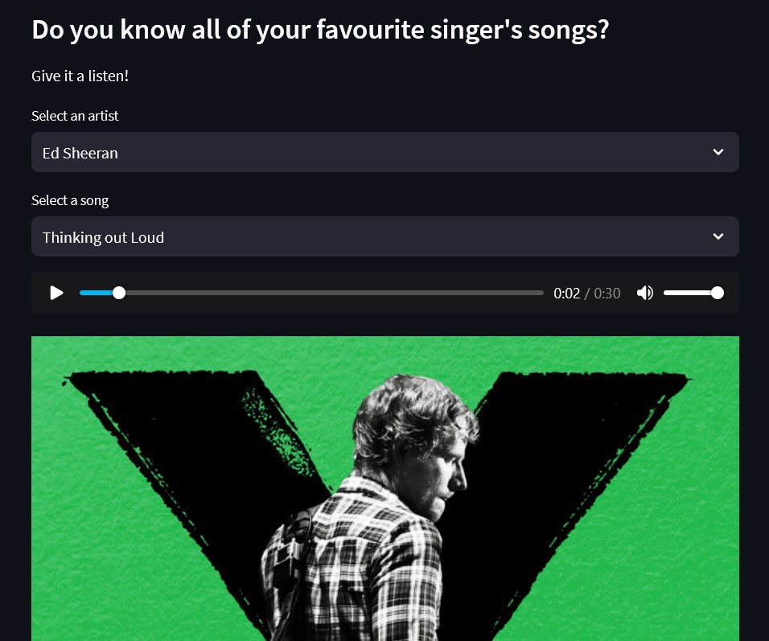

# Streamlit Kaggle Connection Demo App
This is a demo app that leverages the recently released `st.experimental_connection` feature in Streamlit to connect to the Kaggle API for extracting CSV data.

As a reference, the following code is used in `app.py`:

```python
conn = st.experimental_connection("kaggle_datasets", type=KaggleConnection)
df = conn.get(path='joebeachcapital/top-10000-spotify-songs-1960-now', filename='top_10000_1960-now.csv', ttl=3600)
```

To see this in action, [click here](https://kaggle-connection-demo.streamlit.app/) to launch the Streamlit application.
<br>
<br>
Here's a snippet of the app:
<br>

